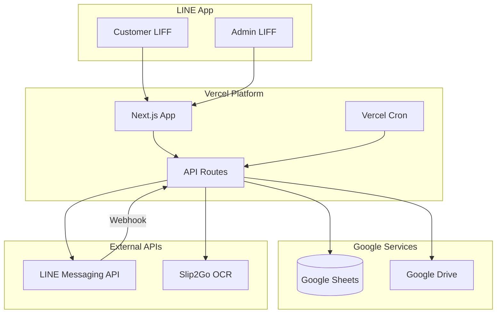

# Loan Management System - LINE LIFF + Next.js

## Architecture Overview




## Technology Stack (per PRD v3.0)

| Component | Technology | Purpose ||-----------|------------|---------|| Customer UI | LINE LIFF (Next.js) | Apply, check status, upload slips || Admin UI | LINE LIFF (Next.js) | Dashboard, approve, manage || Backend | Next.js API Routes | Business logic, API || Database | Google Sheets API | Store all data || File Storage | Google Drive API | Documents, slips || Notifications | LINE Messaging API | Push messages || Hosting | Vercel | Deploy, cron jobs || OCR | Slip2Go API | Verify payment slips |---

## Project Structure

Based on PRD Section 7.1:

```javascript
line-lender-app-poc/
├── src/
│   ├── app/                      # Next.js App Router
│   │   ├── (customer)/           # Customer LIFF pages
│   │   │   ├── apply/page.tsx
│   │   │   ├── status/page.tsx
│   │   │   ├── contracts/page.tsx
│   │   │   ├── payment/page.tsx
│   │   │   └── slip/page.tsx
│   │   ├── (admin)/              # Admin LIFF pages
│   │   │   ├── dashboard/page.tsx
│   │   │   ├── applications/
│   │   │   │   ├── page.tsx
│   │   │   │   ├── pending/page.tsx
│   │   │   │   └── [id]/page.tsx
│   │   │   ├── contracts/
│   │   │   ├── payments/
│   │   │   ├── reports/page.tsx
│   │   │   └── settings/page.tsx
│   │   ├── api/                  # API Routes
│   │   │   ├── applications/
│   │   │   ├── contracts/
│   │   │   ├── payments/
│   │   │   ├── notifications/
│   │   │   ├── line/webhook/
│   │   │   ├── slip/verify/
│   │   │   └── cron/
│   │   └── layout.tsx
│   ├── components/
│   │   ├── ui/                   # shadcn/ui components
│   │   ├── forms/
│   │   ├── dashboard/
│   │   └── liff/
│   ├── lib/
│   │   ├── google-sheets.ts
│   │   ├── google-drive.ts
│   │   ├── line.ts
│   │   ├── liff.ts
│   │   ├── slip2go.ts
│   │   ├── auth.ts
│   │   └── calculations.ts
│   ├── types/
│   └── hooks/
├── public/
├── .env.local
├── next.config.js
├── tailwind.config.js
├── vercel.json
└── package.json
```

---

## Implementation Phases

### Phase 1: Project Setup and Foundation (2-3 days)

**1.1 Initialize Next.js Project**

- Create Next.js 14+ project with App Router
- Configure TailwindCSS + shadcn/ui
- Set up TypeScript
- Configure environment variables

**1.2 Google Services Setup**

- Create Google Service Account
- Set up Google Sheets with required tabs (per PRD Section 7.2):
- Applications, Contracts, Payment_Schedule, Payments, Users, Notification_Log, Settings
- Create Google Drive folder structure
- Implement `lib/google-sheets.ts` and `lib/google-drive.ts`

**1.3 LINE Setup**

- Create LINE Official Account
- Enable Messaging API
- Create LINE Login channel
- Create 2 LIFF apps (Customer + Admin)
- Implement `lib/line.ts` and `lib/liff.ts`

**1.4 Deploy to Vercel**

- Connect GitHub repository
- Configure environment variables
- Set up custom domain (if available)

---

### Phase 2: Module 1 - Application and Approval (3-4 days)

**2.1 Customer LIFF - Apply Page**Per PRD FR-101 to FR-107:

- LIFF initialization and LINE User ID capture
- Application form with validation:
- Name, National ID (13 digits), Phone (10 digits)
- Loan amount, purpose, collateral details
- Document upload to Google Drive
- Submit to Google Sheets
- Confirmation message

**2.2 API Routes for Applications**

```typescript
// /api/applications - POST: Create application
// /api/applications - GET: List applications (with filters)
// /api/applications/[id] - GET: Get application details
// /api/applications/[id] - PATCH: Update status
// /api/applications/[id]/approve - POST: Approve with terms
// /api/applications/[id]/reject - POST: Reject with reason
```

**2.3 Admin LIFF - Applications Management**Per PRD FR-110 to FR-117:

- Authentication using LINE User ID + role mapping
- Pending applications list with filters
- Application detail view with document links
- Approval form (amount, interest rate, term, payment day)
- Action buttons: Approve, Request Docs, Reject
- Auto-create Contract and Payment Schedule on approval

**2.4 Notification Flow**Per PRD FR-108, FR-109, FR-116:

- Notify Admin on new application (LINE push message)
- Notify Customer on approval/rejection/request docs

---

### Phase 3: Module 2 - Debt Tracking and Interest Calculation (2-3 days)

**3.1 Interest Calculation Logic**Per PRD FR-201 to FR-203:

```typescript
// lib/calculations.ts
function calculateMonthlyPayment(principal: number, rate: number, months: number) {
  const monthlyInterest = principal * (rate / 100);
  const monthlyPrincipal = principal / months;
  return monthlyPrincipal + monthlyInterest;
}

function generatePaymentSchedule(contract: Contract): PaymentSchedule[] {
  // Generate schedule with due dates, amounts, status
}
```

**3.2 Daily Processing Cron Job**Per PRD FR-204 to FR-206:

```typescript
// /api/cron/daily - Triggered at 08:00 Bangkok time
// - Calculate outstanding balance for each contract
// - Update days overdue
// - Identify contracts needing reminders
```

**3.3 Payment Recording**Per PRD FR-207 to FR-210:

- Admin LIFF: Record payment with slip upload
- Customer LIFF: Submit slip for payment
- Verification workflow (pending -> verified/rejected)
- Auto-update balance on verification

---

### Phase 4: Module 3 - Notification System (2 days)

**4.1 LINE Messaging API Integration**Per PRD FR-301 to FR-303:

```typescript
// lib/line.ts
async function sendPushMessage(userId: string, messages: Message[]) {
  // Send push message using LINE Messaging API
}

// Webhook handler for LINE events
// /api/line/webhook - Handle follow, message, postback events
```

**4.2 Automated Notifications (Vercel Cron)**Per PRD FR-304 to FR-307:

```json
// vercel.json
{
  "crons": [
    { "path": "/api/cron/reminders", "schedule": "0 1 * * *" },
    { "path": "/api/cron/daily-report", "schedule": "0 11 * * *" }
  ]
}
```

Notification triggers:

- 7 days before due date
- On due date
- 1, 7, 14, 30 days overdue
- Escalation to Admin at 30+ days

**4.3 Notification Templates**Thai language templates per PRD Appendix A:

- New application (to Admin)
- Approval/Rejection (to Customer)
- Payment reminders
- Overdue alerts

**4.4 Notification Logging**Per PRD FR-308:

- Log all notifications to Google Sheets
- Track success/failure status

---

### Phase 5: Module 4 - Dashboard and Reports (2-3 days)

**5.1 Admin Dashboard**Per PRD FR-401 to FR-404:Summary cards:

- Total contracts
- Total disbursed amount
- Total outstanding
- Overdue count
- On-time payment rate
- Pending applications count

Charts:

- Contract status distribution (Active/Completed/Default)
- Aging report (Current, 1-7, 8-30, 31-60, 60+ days)

Overdue list with action buttons**5.2 Automated Reports**Per PRD FR-405 to FR-407:

- Daily report at 18:00 -> Send to Admin via LINE
- Monthly report on 1st at 09:00

Report content:

- New applications
- Approvals/Rejections
- Payments received
- Outstanding balance
- Overdue list

**5.3 Customer Dashboard**

- Current loan status
- Payment schedule
- Outstanding balance
- Next payment due

---

### Phase 6: Module 5 - Slip OCR (2 days)

**6.1 Slip Upload Flow**Per PRD FR-501:

- Customer LIFF: Upload slip after payment
- Admin LIFF: Upload slip when recording payment

**6.2 Slip2Go Integration**Per PRD FR-502 to FR-505:

```typescript
// lib/slip2go.ts
async function verifySlip(imageBase64: string): Promise<SlipData> {
  // Call Slip2Go API
  // Return: amount, date, bank, transactionId
}
```

**6.3 Auto-Matching Logic**

```typescript
// Match slip to payment schedule
// Tolerance: ±100 THB
// If single match: auto-verify
// If multiple/no match: queue for manual review
```

---

## Key Files to Create

| Priority | File | Purpose ||----------|------|---------|| P1 | `src/lib/google-sheets.ts` | Google Sheets API wrapper || P1 | `src/lib/google-drive.ts` | Google Drive API wrapper || P1 | `src/lib/line.ts` | LINE Messaging API wrapper || P1 | `src/lib/liff.ts` | LIFF initialization utilities || P1 | `src/lib/auth.ts` | Role-based authentication || P2 | `src/lib/calculations.ts` | Interest and payment calculations || P2 | `src/lib/slip2go.ts` | Slip2Go API integration || P1 | `src/app/(customer)/apply/page.tsx` | Customer application form || P1 | `src/app/(admin)/dashboard/page.tsx` | Admin dashboard || P1 | `src/app/(admin)/applications/[id]/page.tsx `| Application review || P2 | `src/app/api/cron/daily/route.ts` | Daily processing cron || P2 | `src/app/api/line/webhook/route.ts` | LINE webhook handler |---

## Environment Variables

```env
# LINE Configuration
LINE_CHANNEL_ID=
LINE_CHANNEL_SECRET=
LINE_CHANNEL_ACCESS_TOKEN=
LIFF_ID_CUSTOMER=
LIFF_ID_ADMIN=

# Google Configuration
GOOGLE_SERVICE_ACCOUNT_EMAIL=
GOOGLE_PRIVATE_KEY=
GOOGLE_SPREADSHEET_ID=
GOOGLE_DRIVE_FOLDER_ID=

# Slip2Go
SLIP2GO_API_KEY=

# App Configuration
NEXT_PUBLIC_BASE_URL=
CRON_SECRET=
```

---

## Estimated Timeline

| Phase | Duration | Deliverables ||-------|----------|--------------|| Phase 1: Setup | 2-3 days | Next.js project, Google services, LINE setup, Vercel deploy || Phase 2: Application | 3-4 days | Customer LIFF apply, Admin LIFF review, approval flow || Phase 3: Debt Tracking | 2-3 days | Calculations, payment schedules, daily cron || Phase 4: Notifications | 2 days | LINE push messages, reminders, logging || Phase 5: Dashboard | 2-3 days | Admin dashboard, reports, customer view || Phase 6: Slip OCR | 2 days | Slip2Go integration, auto-matching |**Total: 13-17 days**---

## Prerequisites Checklist